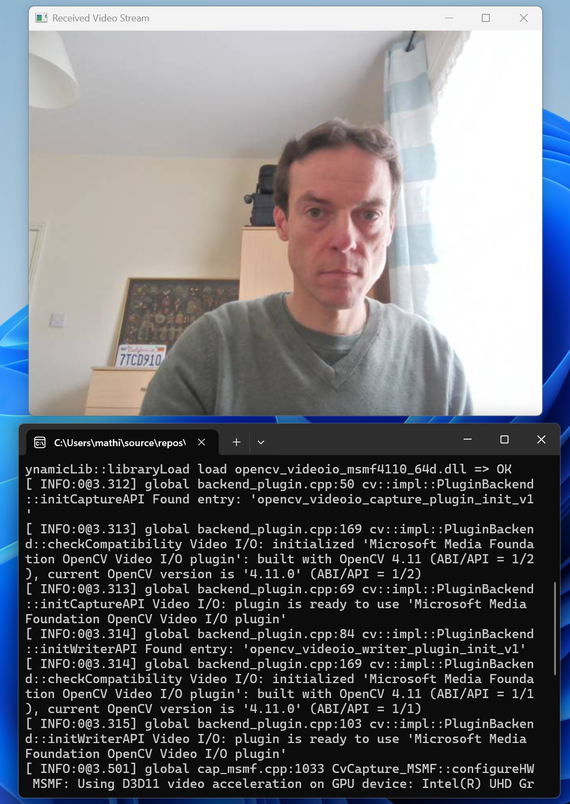

# NetworkTools



**NetworkTools** is a collection of utilities and examples for implementing network protocols from scratch using modern C++ (C++17/20). Built for development in **Visual Studio on Windows**, with POSIX principles in mind for future portability.

## Features

- TCP socket communication

## TODO Features

The following features are planned but not yet implemented:

- UDP socket communication
- Packet encoding/decoding utilities
- Byte-level parsing and serialization
- Example apps: echo server/client, basic protocol parser

## Requirements

- Windows 10/11
- Visual Studio 2022 or later
- Winsock2 (included in Windows SDK)

## Getting Started

1. Clone the repository:
   ```bash
   git clone https://github.com/mathieudelehaye/NetworkTools.git
