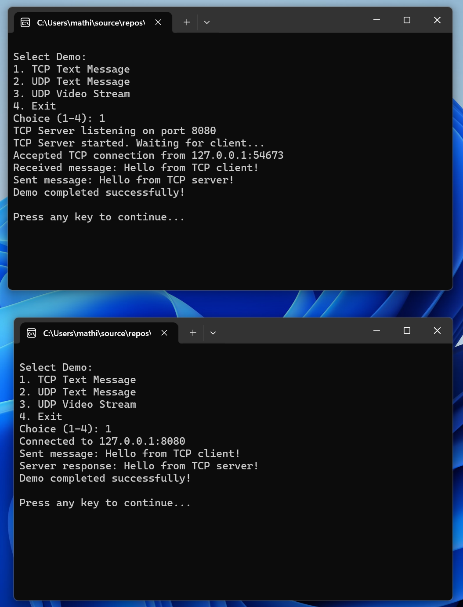

# NetworkTools

<p align="left">
  
  
</p>

**NetworkTools** is a collection of utilities and examples for implementing network protocols and real-time video streaming using C++ and OpenCV. Built for development in **Visual Studio on Windows**, with POSIX principles in mind for future portability.

## Features

- TCP socket communication
- UDP socket communication
- UDP transmission of a webcam stream between server and client using OpenCV (frames are now split into chunks for easier UDP transfer, supporting up to 1080p resolution)

## TODO Features

The following features are planned but not yet implemented:

- Increase client-side framerate (currently below 30 FPS)
- Packet encoding/decoding utilities
- Byte-level parsing and serialization
- Example apps: basic protocol parser

## Requirements

- Windows 10/11
- Visual Studio 2022 or later
- Winsock2 (included in Windows SDK)
- OpenCV 4.11+ (required for webcam streaming feature)

## Getting Started

1. Clone the repository:
   ```bash
   git clone https://github.com/mathieudelehaye/NetworkTools.git
