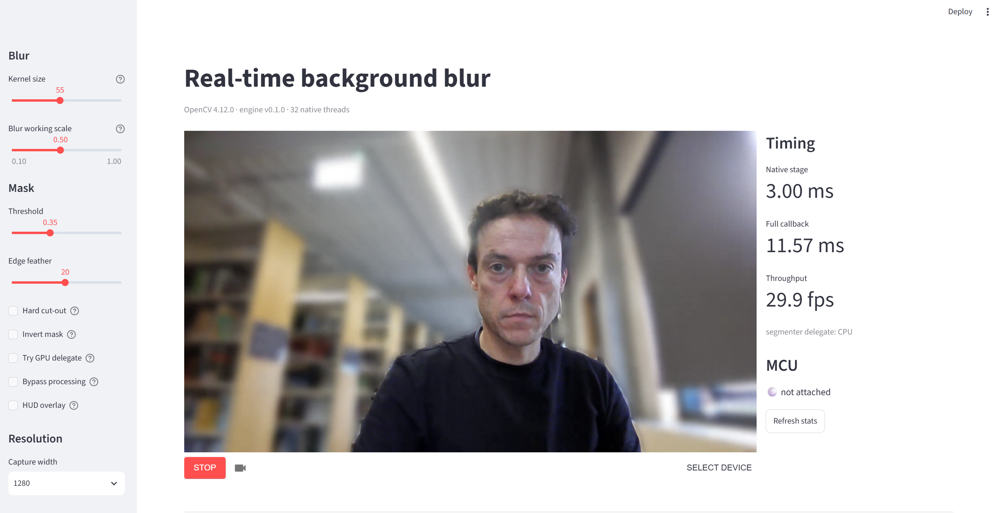

# NetworkTools

<p align="left">
  
</p>

**NetworkTools** is a real-time WebRTC background-blur application. A browser captures the webcam via `getUserMedia`, a Python/Streamlit backend runs MediaPipe person segmentation and forwards each frame into a native C++/OpenCV engine (bound with pybind11) that blurs the background and composites the result, and the processed stream is sent back to the browser and, optionally, relayed to an upstream WebRTC MCU.

The project started as a set of raw TCP/UDP socket examples (chunked webcam streaming over UDP); that original client/server code is being phased out in favour of the WebRTC pipeline described below. See [Legacy: raw TCP/UDP streaming](#legacy-raw-tcpudp-streaming) for what remains of it.

## Architecture

```
Chrome (getUserMedia)
   │  WebRTC (aiortc, via streamlit-webrtc)
   ▼
Streamlit app (src/python-server/app.py)
   │
   │  av.VideoFrame.to_ndarray(format="rgb24")   # no colour conversion anywhere
   ▼
MediaPipe Tasks ImageSegmenter (CPU or GPU delegate)   # person confidence mask
   │
   ▼
cpp_video_engine.VideoProcessor  (native_engine.cpp, pybind11 + OpenCV)
   │  - Gaussian blur at reduced scale, upscaled back
   │  - mask feathering / thresholding
   │  - alpha composite (frame over blurred background)
   ▼
av.VideoFrame  ──► back to Chrome (loopback, always)
                └─► optional second hop to an upstream WebRTC MCU (MCUForwarder)
```

Everything downstream of the browser runs inside a single WebRTC worker thread per stream; the native engine and the segmenter are the only per-frame costs that matter (roughly 6–7 ms and 6–15 ms respectively on CPU for a 720p frame).

## Components

### `src/cpp-lib/` — native engine

- `native_engine.cpp`: a pybind11 extension module, `cpp_video_engine`, built on OpenCV. Exposes a `VideoProcessor` class (`process`, `process_into`, `process_inplace`) that takes a zero-copy `(H, W, 3)` uint8 frame and an `(H, W)` or `(H, W, 1)` float32 mask, and returns/writes the frame with its background Gaussian-blurred and alpha-composited against the original. Also exposes `draw_hud()`, an optional on-frame status overlay (resolution/FPS/timing), carried over from the original preview windows. The module is channel-order agnostic (no `cvtColor` in the hot path) since blur and blending don't care whether the buffer is RGB or BGR.
- `CMakeLists.txt`: builds the module against **vcpkg**-provided OpenCV (static triplet, so the resulting `.so` is self-contained) and a **pip**-provided pybind11 (deliberately not the vcpkg port, which would otherwise compile an entire CPython just to find an interpreter). The built module is dropped directly into `src/python-server/` so Streamlit can `import cpp_video_engine`.
- `vcpkg.json`: pins the OpenCV features actually used — `intrinsics` and `thread` (SIMD + `parallel_for_`), `jpeg`, `png`. `imgproc`/`core` are always-built OpenCV modules, not vcpkg features, so they aren't listed.

### `src/python-server/` — application

- `app.py`: the Streamlit UI and WebRTC pipeline.
  - `Segmenter`: wraps MediaPipe's Tasks `ImageSegmenter` (the legacy `mp.solutions.selfie_segmentation` API was removed in MediaPipe ≥0.10.30). Handles the VIDEO-mode monotonic-timestamp requirement, resolves which output mask channel is the foreground, and downloads the `.tflite` model on first run.
  - `BlurProcessor` (`VideoProcessorBase`): per-stream pipeline — grabs an RGB frame, runs the segmenter, calls into `cpp_video_engine`, optionally burns in the HUD, optionally forwards the result to an MCU, and returns the frame to the browser.
  - `MCUForwarder` / `_QueueVideoTrack`: an optional, fully decoupled second WebRTC leg that pushes the already-processed frame upstream to an MCU (JSON or WHIP signalling). Non-blocking, bounded queue, automatic reconnect with backoff — a down or unconfigured MCU never affects the local loopback.
  - A preflight check (`check_mediapipe_runtime`) loads MediaPipe's native library at startup so a missing system OpenGL/EGL dependency surfaces as a clear Streamlit error instead of a raw `OSError` from inside a worker thread.
  - Sidebar controls: blur kernel size and working scale, mask threshold/feather/hard-cutoff/invert, GPU-delegate toggle, capture resolution, bypass (A/B) toggle, HUD toggle, and MCU forwarding target.
- `smoke_test.py`: exercises the native engine in isolation (no browser/WebRTC involved) — verifies mask polarity, background blurring, the zero-allocation (`process_into`) and in-place (`process_inplace`) paths agree with the default `process()`, the HUD overlay, and prints a 720p per-frame timing benchmark.
- `requirements.txt`: Python dependencies — `pybind11` (build-time only, for the native module), `streamlit` + `streamlit-webrtc` + `aiortc` + `av` (WebRTC), `aiohttp` (MCU signalling), `mediapipe`, `numpy` (pinned `<2.1` for MediaPipe's ABI). `opencv-python` is deliberately absent: all OpenCV work happens inside `cpp_video_engine`, which statically links its own copy.
- `models/`: holds `selfie_segmenter.tflite`, downloaded automatically on first run (falls back to a manual `curl` command shown in the UI if the model host is unreachable).

## Features

- Real-time background blur over WebRTC, browser to browser via a Python backend
- Person segmentation via MediaPipe's Tasks `ImageSegmenter` (CPU, with an opt-in/best-effort GPU delegate)
- Native OpenCV blur + alpha-compositing engine in C++, bound to Python with pybind11, zero-copy on the way in
- Optional relay of the processed stream to an upstream WebRTC MCU (JSON or WHIP signalling), decoupled from the local loopback
- Optional on-frame HUD overlay (resolution / FPS / native processing time)
- Live tunables: blur kernel size, working scale, mask threshold, edge feather, hard cutoff, mask inversion
- Live timing stats (native stage, full callback, throughput) in the sidebar

## Requirements

- Linux (developed against WSL2 Ubuntu; should work on any modern Linux)
- Python 3.10–3.12 (MediaPipe has no wheels for 3.13 yet)
- CMake 3.15+, Ninja, a C++17 compiler
- [vcpkg](https://github.com/microsoft/vcpkg) (bootstrapped locally, `VCPKG_ROOT` set) — provides OpenCV
- `pybind11` (installed via pip into the same Python environment used to build the native module)
- System OpenGL ES / EGL libraries — MediaPipe's Tasks native library links against them unconditionally, even for CPU-only inference:
  ```bash
  sudo apt install -y build-essential cmake ninja-build git curl zip unzip tar \
       pkg-config python3-dev python3-venv nasm libgles2 libegl1
  ```

## Getting Started

```bash
# 1. vcpkg, once
git clone https://github.com/microsoft/vcpkg ~/vcpkg
~/vcpkg/bootstrap-vcpkg.sh -disableMetrics
export VCPKG_ROOT=$HOME/vcpkg

# 2. Python env first — the .so must be built against the interpreter that imports it
cd src/python-server
python3 -m venv .venv && source .venv/bin/activate
pip install -r requirements.txt

# 3. build the native engine (first configure also builds OpenCV via vcpkg: 20-40 min)
cd ../cpp-lib
cmake -S . -B build -G Ninja -DCMAKE_BUILD_TYPE=Release \
      -DPython3_EXECUTABLE=$(which python)
cmake --build build -j$(nproc)

# 4. verify the module alone, before WebRTC is in the picture
cd ../python-server
python smoke_test.py

# 5. run
streamlit run app.py            # then open http://localhost:8501
```

Rebuilding the native module requires restarting `streamlit run`: Python caches extension modules for the process lifetime, so a hot-reloaded Streamlit session keeps running the old `.so`.

## TODO / Known limitations

- GPU delegate support for MediaPipe segmentation is best-effort on Linux; the pip wheel frequently ships without a working GPU backend and falls back to CPU automatically
- No authentication/encryption is layered on top of the MCU signalling handshake — treat `mcu_url` as a trusted endpoint
- Packet encoding/decoding utilities, byte-level parsing/serialization examples (from the original scope) are not implemented

## Legacy: raw TCP/UDP streaming

The repository originally contained standalone TCP and UDP socket examples, including a UDP webcam streamer that split JPEG frames into application-layer chunks with a small header for reassembly on the client. That code predates the WebRTC pipeline above and is being retired in favour of it; call it archaeology rather than a supported feature going forward.

## Getting Started (legacy Windows sources)

1. Clone the repository:
   ```bash
   git clone https://github.com/mathieudelehaye/NetworkTools.git
